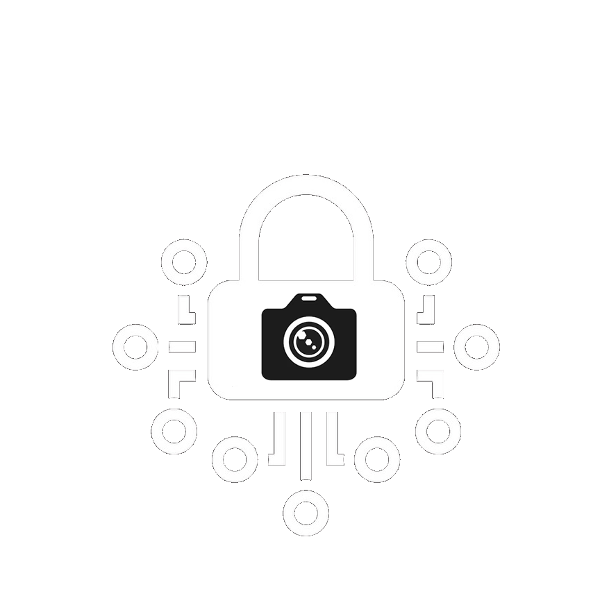
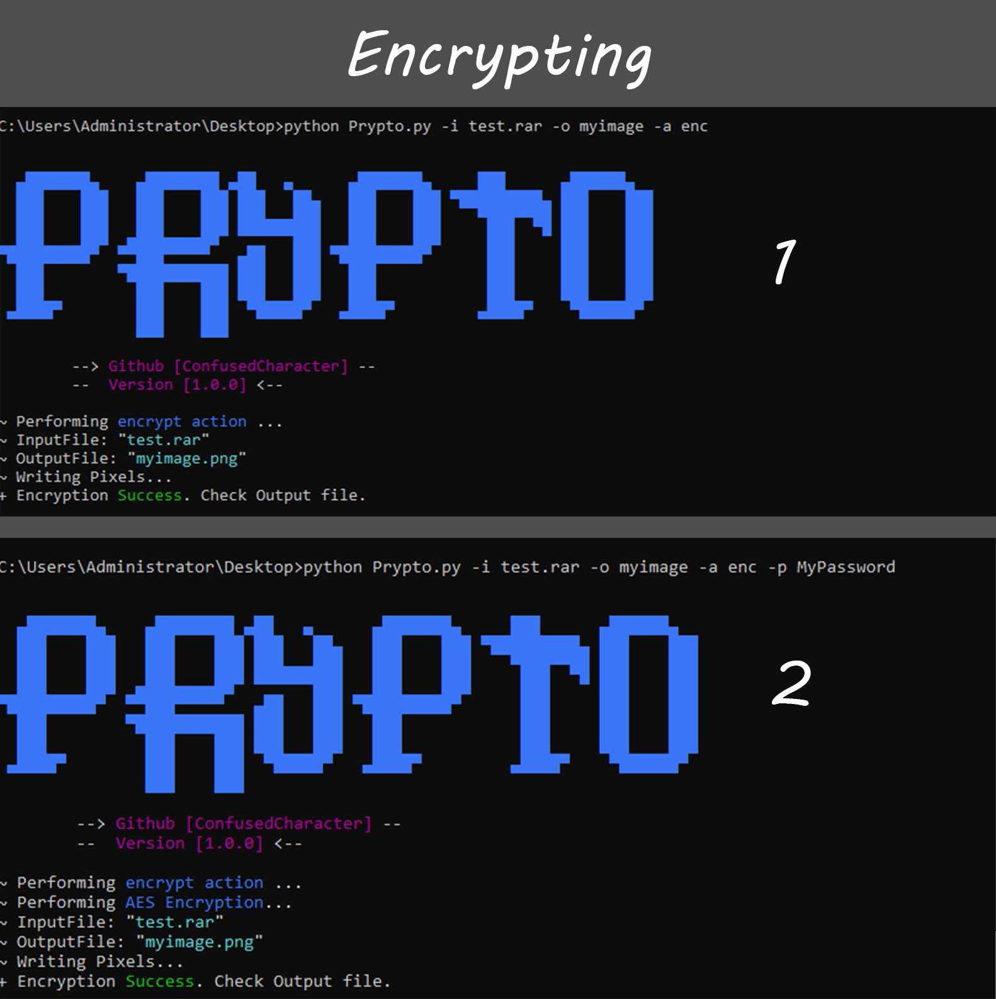

<a name="readme-top"></a>


<!-- PROJECT LOGO -->
<br />
<div align="center">
  <a href="https://github.com/ConfusedCharacter/Prypto">
    
  </a>

  <h3 align="center">Prypto</h3>

  <p align="center">
    Welcome to Prypto - Picture Cryptography Tool!
    <br />
    <br />
    ·
    <a href="https://github.com/ConfusedCharacter/Prypto/issues">Report Bug</a>
    ·
    <a href="https://github.com/ConfusedCharacter/Prypto/issues">Request Feature</a>
  </p>
</div>


## About The Prypto

Prypto is an open-source tool designed to convert files into photos and vice versa. It allows you to encrypt files by converting them to images and decrypt them back to files. By adding a password to your files, Prypto uses AES encryption to ensure their security.


### Here's how it works:


1. File Conversion: Prypto utilizes the RGB range of 0 to 255 in images. To convert a file into a picture, the tool first encodes the file into Base64 format. Base64 characters range up to 128, so each character is further converted into decimal using the 'ord' function. Each pixel of the image is then used to store the decimal value of a character.

2. Encryption: When decrypting the picture back into a file, Prypto reverses the process. It reads the pixel values from the image and converts them back to decimals. These decimal values are then converted into Base64 characters, and finally, the original file is reconstructed.


### Installation

This is an example of how to list things you need to use the software and how to install them.
1. install pip and packages
    ```sh
    apt install python3-pip; pip3 install numpy pillow
    ```
2. Clone the repo
   ```sh
   git clone https://github.com/ConfusedCharacter/Prypto.git; cd Prypto
   ```
   
4. Run it `Prypto.py`
   ```sh
   python3 Prypto.py -h
   ```

## Usage

  ```sh
    usage: Prypto.py [-h] [-a ACTION] [-i INPUT] [-o OUTPUT] [-p PASSWORD]        
    
    [Prypto Tool] Convert any file to Picture.
    
    optional arguments:
      -h, --help            show this help message and exit
      -a ACTION, --action ACTION
                            Action: enc for encrypt and dec for decrypt
      -i INPUT, --input INPUT
                            Input File Such as .zip , .txt or anything.
      -o OUTPUT, --output OUTPUT
                            Output file for encryption. Example: Prypto
      -p PASSWORD, --password PASSWORD
                            If you want to add a password.
  ```
<div align="left">

</div>

<!-- ROADMAP -->
## Roadmap

- [x] Can be password protected
- [x] Encrypt With AES
- [x] Support all file types for encryption
- [x] The photo is legible and does not break

See the [open issues](https://github.com/ConfusedCharacter/Prypto/issues) for a full list of proposed features (and known issues).


<!-- LICENSE -->
## License

Distributed under the MIT License. See `LICENSE.txt` for more information.

<p align="right">(<a href="#readme-top">back to top</a>)</p>


## Contact

ConfusedCharacter - ConfusedCharacterSup@gmail.com

Project Link: [https://github.com/ConfusedCharacter/Prypto](https://github.com/ConfusedCharacter/Prypto)

